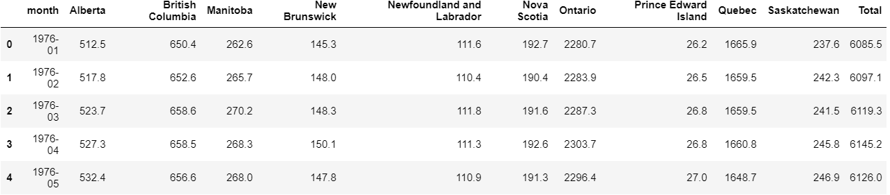
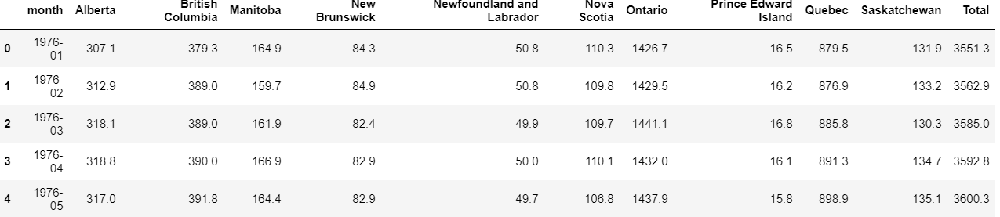
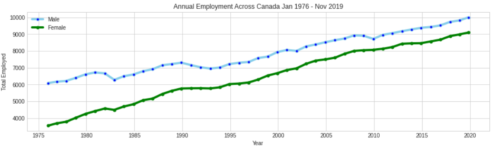
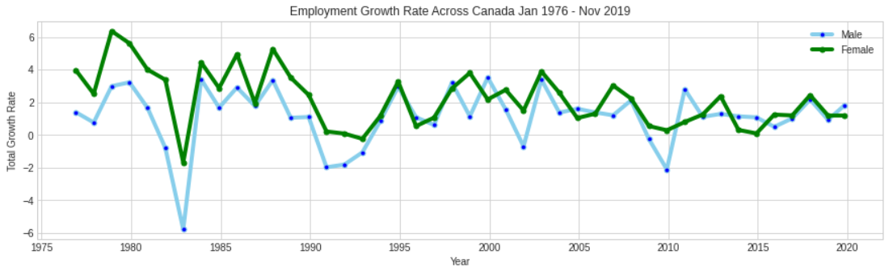
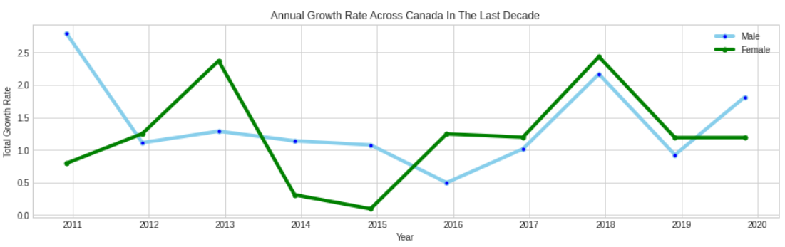

# Empolyment Trends in Canada
Data Science project involving data containing Canada's empolyment from 1976-2019. Goal is to visualize trends regarding gender employment over time.
These results are not official by any means and are done with the sole purpose of expanding my usage with datasets.

## Dataset:
Link: https://www.kaggle.com/ortizmacleod/employment-rate-canada

### Dataset Description:
Provincial statistics on the employment rate in Canada from 1976-2019. Data in this file is presented according to month, province, gender, and type of employment (full-time, part-time, and all). Kagglers are welcome to play with this data to gain a better understanding of the trends of employment in Canada during the last few decades. While the data was originally retrieved from the Labour Market Council of Canada, more data is this sort is available from Statistics Canada.

# Results:
Dividing dataset into Male and Female.
Male Dataset:

Female Dataset:

Annual Employment Graph

Growth Rate Graph

Growth Rate In A Decade

